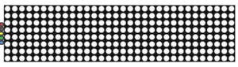

# bozontlabsMAX7219

**MAX7219 Arduino driver library** for LED matrix displays.

This library supports multiple MAX7219 chips connected in a daisy-chain (cascade) configuration and allows the display to be addressed using absolute X/Y coordinates.
Each MAX7219 typically drives an 8×8 LED matrix, and displays are commonly sold as pre-assembled 4-module (32×8) units.

The library can drive the display using either software-emulated SPI or hardware SPI.
Software SPI is highly flexible and allows the display to be connected to any GPIO pin. Hardware SPI is restricted to the dedicated SPI pins but delivers much higher update speeds compared to the software-emulated approach.

## Features
 - Software emulated SPI support
 - Hardware SPI support
 - Absolute X/Y addressing of pixels
 - Brightness control
 - Power control

## Usage

For usage in practice please see the included examples.

Create an instance with software emulated SPI on any GPIO:

 - `bozontlabsMAX7219 max7219 = bozontlabsMAX7219(DISP_SPI_CS, DISP_SPI_MOSI, DISP_SPI_CLK, DISP_NUMBER_OF_DEVICES);`
 - `bozontlabsMAX7219 max7219 = bozontlabsMAX7219(D0, D1, D2, 4);`

Or with hardware SPI on the dedicated SPI pins:

 - `bozontlabsMAX7219 max7219 = bozontlabsMAX7219(DISP_SPI_CS, DISP_NUMBER_OF_DEVICES);`
 - `bozontlabsMAX7219 max7219 = bozontlabsMAX7219(D0, 4);`

This call above will use the default SPI instance - however if your board has multiple SPI hardware you can specify which one to use:

 - `bozontlabsMAX7219 max7219 = bozontlabsMAX7219(D0, 4, &SPI1);`

You can also specify the bus speed in Hz:

 - `bozontlabsMAX7219 max7219 = bozontlabsMAX7219(D0, 4, &SPI1, 7500000);`

Before calling any library functions initialize the display with:

 - `begin()`

API functions:
 - `begin()` - initializes the display
 - `end()` - deinitializes the display
 - `getDeviceCount()` - returns the number of cascaded MAX7219 devices configured
 - `getDisplayWidth()` - returns the calculated display width in pixels
 - `getDisplayHeight()` - returns the calculated display height in pixels
 - `setDisplayOn(display_on)` - turns the display on/off
 - `getDisplayOn()` - returns whether the display is on or off
 - `setBrightness(brightness)` - sets the brightness of the display (0-15)
 - `clearDisplay()` - clears the contents of the display
 - `setPixel(x, y, value)` - sets or clears a pixel in the specified location

##

##### This library is originally based on the [LedControl](https://github.com/wayoda/LedControl) library and includes the license from there.
